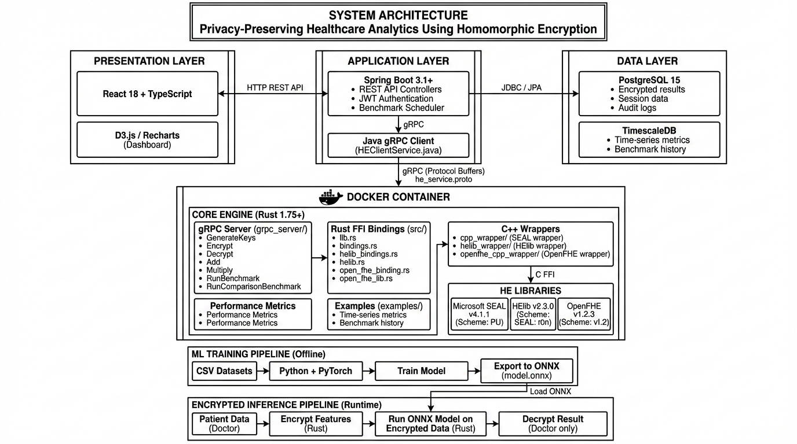

# Encrypted Machine Learning Benchmark Framework

> **Privacy-Preserving Healthcare Analytics:  Enabling hospitals to collaborate on sensitive patient data—without anyone ever seeing the actual numbers.**

[](https://www.rust-lang.org/)
[](https://spring.io/projects/spring-boot)
[](https://www.docker.com/)
[](LICENSE)

---

## The Problem

Hospitals and healthcare organizations need to collaborate—sharing patient statistics, running joint research, detecting regional disease outbreaks.  But they **can't share raw data** due to: 

- **Privacy regulations** (GDPR, HIPAA)
- **Competition between institutions**
- **Legal liability concerns**
- **Risk of data breaches**

**Traditional encryption doesn't solve this. ** With AES or RSA, you must decrypt data before processing—meaning the server sees everything at some point.

---

## The Solution:  Homomorphic Encryption

**Homomorphic Encryption (HE)** lets you compute directly on encrypted data.  The server never decrypts anything—it processes ciphertext and returns ciphertext.  Only the authorized party can decrypt the result.

```
┌─────────────────────────────────────────────────────────────────────────┐
│                        HOW IT WORKS                                     │
├─────────────────────────────────────────────────────────────────────────┤
│                                                                         │
│   Hospital A: Encrypt(50 patients)  →  [ciphertext_A]                   │
│   Hospital B: Encrypt(30 patients)  →  [ciphertext_B]                   │
│   Hospital C: Encrypt(45 patients)  →  [ciphertext_C]                   │
│                                                                         │
│                         ↓ Send to Server ↓                              │
│                                                                         │
│   Server adds: [ciphertext_A] + [ciphertext_B] + [ciphertext_C]         │
│   (Server sees ONLY random bytes—has no idea what the numbers are)      │
│                                                                         │
│                         ↓ Return to Authority ↓                         │
│                                                                         │
│   Decrypt: [ciphertext_result]  →  125 patients                         │
│   (Correct total:  50 + 30 + 45 = 125)                                   │
│                                                                         │
│   The server computed the answer but NEVER saw the actual data.         │
│                                                                         │
└─────────────────────────────────────────────────────────────────────────┘
```

---

## What This Framework Offers

### 1. Regional Disease Outbreak Detection
Health authorities can query total ICU patients, COVID cases, or emergency admissions across multiple hospitals—without any hospital revealing their actual numbers.

### 2. Collaborative Medical Research
Researchers can compute averages, trends, and statistics across institutions.  Calculate regional survival rates, treatment effectiveness, or bed availability—all on encrypted data.

### 3. Encrypted ML Predictions
Train models on patient features (age, blood pressure, cholesterol). Doctors encrypt patient data, the model runs on ciphertext, and returns an encrypted prediction.  **The server never sees the patient's information.**

```
┌───────────────────────────────────────────────────────────────┐
│                 ENCRYPTED ML PREDICTION                       │
├───────────────────────────────────────────────────────────────┤
│                                                               │
│   Doctor inputs: Age:  55, BP: 140, Cholesterol: 220           │
│                              ↓                                │
│                     Encrypt each value                        │
│                              ↓                                │
│   Sent to server: [encrypted_age, encrypted_bp, ...]         │
│                              ↓                                │
│           Model runs on encrypted features                    │
│                              ↓                                │
│   Returns:  [encrypted_prediction]                             │
│                              ↓                                │
│   Doctor decrypts: "Heart Disease Risk:  78% - HIGH"           │
│                                                               │
│   Server processed everything but learned NOTHING.             │
│                                                               │
└───────────────────────────────────────────────────────────────┘
```

### 4. Cross-Library Benchmarking
Compare three major HE libraries side-by-side: 
- **Microsoft SEAL** — BFV/CKKS schemes
- **IBM HElib** — BGV scheme
- **OpenFHE** — Multi-scheme support

Measure key generation, encryption, decryption, addition, and multiplication speeds. 

### 5. Security Testing
Simulate attacks on the encrypted system:
- Corrupted ciphertext injection
- Parameter manipulation
- Weak configuration detection

---

## System Architecture



---

## Quick Start

### Prerequisites
- [Docker](https://docs.docker.com/get-docker/) & [Docker Compose](https://docs.docker.com/compose/install/)

### Run with Docker

```bash
# Clone the repository
git clone https://github.com/TiffanyYongNgikChee/Encrypted-Machine-Learning-Benchmark-Framework.git
cd Encrypted-Machine-Learning-Benchmark-Framework

# Build (takes 10-15 minutes due to HE library compilation)
docker-compose build

# Start containers
docker-compose up -d

# Enter the container
docker-compose exec he-benchmark bash

# Build and run
cargo build --release
cargo run --example benchmark --release
```

---

## Tech Stack

| Layer | Technology | Purpose |
|-------|------------|---------|
| Frontend | React + TypeScript | Dashboard, data entry, visualizations |
| Visualization | D3.js / Recharts | Charts, benchmarking results |
| Backend API | Spring Boot (Java) | REST endpoints, JWT authentication |
| gRPC Client | Java gRPC | Bridge to Rust HE engine |
| HE Engine | Rust + gRPC | Encrypted computations |
| HE Libraries | SEAL, HElib, OpenFHE | Homomorphic encryption operations |
| FFI Wrappers | C++ | Bridge between Rust and HE libraries |
| Database | PostgreSQL + TimescaleDB | Time-series analytics storage |
| ML | Python + PyTorch | Model training (ONNX export) |
| Containers | Docker + Compose | Reproducible deployment |

---

## Project Structure

```
├── cpp_wrapper/              # Microsoft SEAL C++ wrapper
├── helib_wrapper/            # HElib C++ wrapper
├── openfhe_cpp_wrapper/      # OpenFHE C++ wrapper
├── grpc-server/              # Rust gRPC server for HE operations
├── grpc-client/              # Rust gRPC client for testing
├── java-grpc-client/         # Spring Boot + Java gRPC client
│   ├── src/main/java/
│   │   ├── HeClientService   # gRPC service wrapper
│   │   ├── DemoRunner        # Demo menu system
│   │   └── ... 
│   └── pom.xml
├── src/                      # Rust FFI bindings
├── examples/                 # Benchmark examples
├── proto/                    # gRPC protocol definitions
├── Dockerfile                # Multi-stage build
├── docker-compose.yml        # Service orchestration
└── README.md
```

---

## Demo Features

| Feature | Description |
|---------|-------------|
| Hospital Management | Add, view, manage hospital entries |
| Patient Data Entry | Encrypted patient statistics submission |
| Regional Analytics | Aggregate encrypted data across hospitals |
| Benchmarking | Compare SEAL vs HElib vs OpenFHE |
| Security Demo | Test encryption/decryption integrity |
| Save/Load Data | Persist encrypted results |

---

## Benchmarking Results

The framework measures performance across all three libraries:

| Operation | SEAL | HElib | OpenFHE |
|-----------|------|-------|---------|
| Key Generation | -- ms | -- ms | -- ms |
| Encryption | -- ms | -- ms | -- ms |
| Decryption | -- ms | -- ms | -- ms |
| Addition | -- ms | -- ms | -- ms |
| Multiplication | -- ms | -- ms | -- ms |

*Run `cargo run --example benchmark --release` to get actual measurements on your hardware.*

---

## ML Datasets

The framework uses public healthcare datasets for model training:

| Dataset | Features | Prediction Target |
|---------|----------|-------------------|
| Breast Cancer Wisconsin | 30 features (radius, texture, etc.) | Malignant / Benign |
| Cleveland Heart Disease | 13 features (age, BP, cholesterol) | Heart disease risk |

---

## Development

### Rebuilding After Changes

```bash
# Inside Docker container
./rebuild_all.sh

# Or rebuild individually
cd cpp_wrapper/build && cmake .. && make && cd ../.. 
cd helib_wrapper/build && cmake .. && make && cd ../..
cd openfhe_cpp_wrapper/build && cmake .. && make && cd ../.. 

cargo build --release
```

### Running Examples

```bash
cargo run --example benchmark --release
cargo run --example medical_data --release
```

---

## Troubleshooting

<details>
<summary><strong>Build fails in Docker</strong></summary>

```bash
docker-compose build --no-cache
```
</details>

<details>
<summary><strong>Library linking errors</strong></summary>

```bash
ls -l /app/*. so
ls -l /usr/local/lib/
ls -l /usr/local/helib_pack/lib/
```
</details>

<details>
<summary><strong>Rust compilation issues</strong></summary>

```bash
cargo clean
cargo build --release
```
</details>

---

## Real-World Applications

This technology is already used by major companies:

| Company | Use Case |
|---------|----------|
| Apple | Keyboard suggestions—training on what you type without seeing it |
| Microsoft | SEAL library, HE on Azure cloud |
| Meta | Private ad measurement |
| Banks | Cross-institution fraud detection |
| Healthcare | Multi-hospital analytics, encrypted research |

---

## Project Roadmap

| Phase | Status | Timeline |
|-------|--------|----------|
| Phase 1: Backend & HE Core | Complete | Nov - Dec 2025 |
| Phase 2: Frontend & ML Setup | In Progress | Jan 2026 |
| Phase 3: Full Features | Planned | Feb - Mar 2026 |
| Phase 4: Testing & Docs | Planned | Apr 2026 |

---

## License

MIT License - see [LICENSE](LICENSE) for details.

---

## Acknowledgments

- [Microsoft SEAL](https://github.com/microsoft/SEAL)
- [HElib](https://github.com/homenc/HElib)
- [OpenFHE](https://github.com/openfheorg/openfhe-development)

---

## Author

**Tiffany Yong Ngik Chee**  
ATU Galway — Final Year Project 2025/2026

Email: g00425067@atu.ie

---

<p align="center">
  <strong>Privacy + Computation = The Future of Healthcare Analytics</strong>
</p>